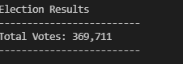
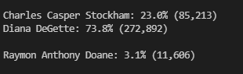
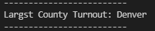
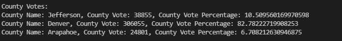

##PyPoll_Challenge
The purpose of the election audit is to have the election automated with the power of coding to calculate the system with no human errors.

Election Results
* How many votes were cast in this congressional election?

As can be seen in the photo above, a lot of people voted here with almost 370,000 people voting

***The number of votes and the percentage of the total votes for each canidate received**

*County with the largest number of votes As shown above, Diana DeGette won by a huge margin. Blowing out Charles Stockham and Raymon Doane.

*County with the largest number of votes

*The winner of the election:

###**Election Audit Summary**

This script is extremely functional and it can be used to determine the outcome of school elections to presidential elections. The way the data frame dervied out of the massive csv file tells you how well we can work around to get the finest possible detail which will help us to jot dowmn the future similar elections.
